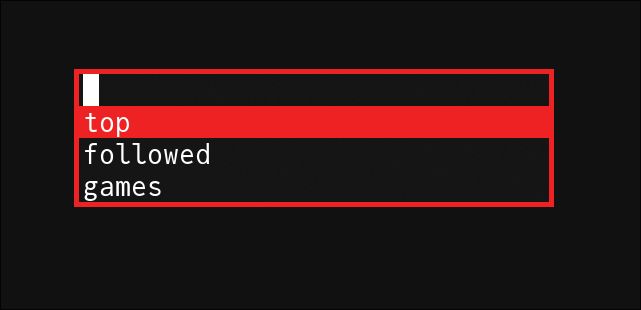

# TwitchMenu



TwitchMenu is a simple yet powerful tool that integrates with `dmenu` to show you who is live on Twitch. With a few simple commands, you can easily manage your favorite streamers and see who is currently streaming.

## Features

- **View Top Streams**: See the top 100 streams currently live on Twitch.
- **Followed Streams**: Check which of your followed streamers are live.
- **Top Games**: Browse the top 100 games being streamed and see who is playing them.
- **Add/Remove Streamers**: Easily manage your list of favorite streamers.

## Dependencies

- `dmenu`

## Installation

1. **Download the Binary**:
   Download the latest release from the [Releases](https://github.com/aiten/twitchmenu/releases) page.

2. **Run the Binary**:
   Make the binary executable and run it:
   ```sh
   chmod +x twitchmenu
   ./twitchmenu
   ```

## Usage

```sh
twitchmenu [OPTION]
```

### Options

- `-a <name>`: Adds a name to the list of streamers.
- `-e`: Opens the list of streamers in your default editor.